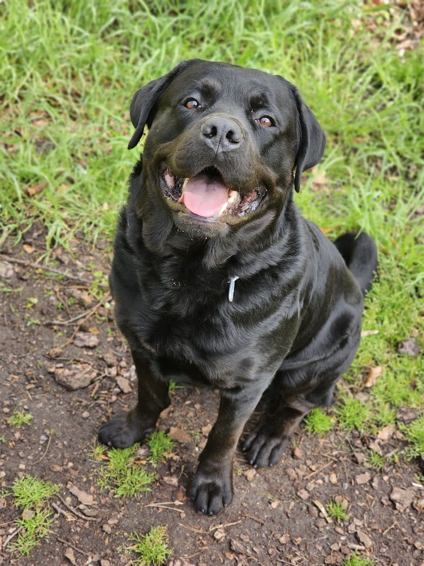
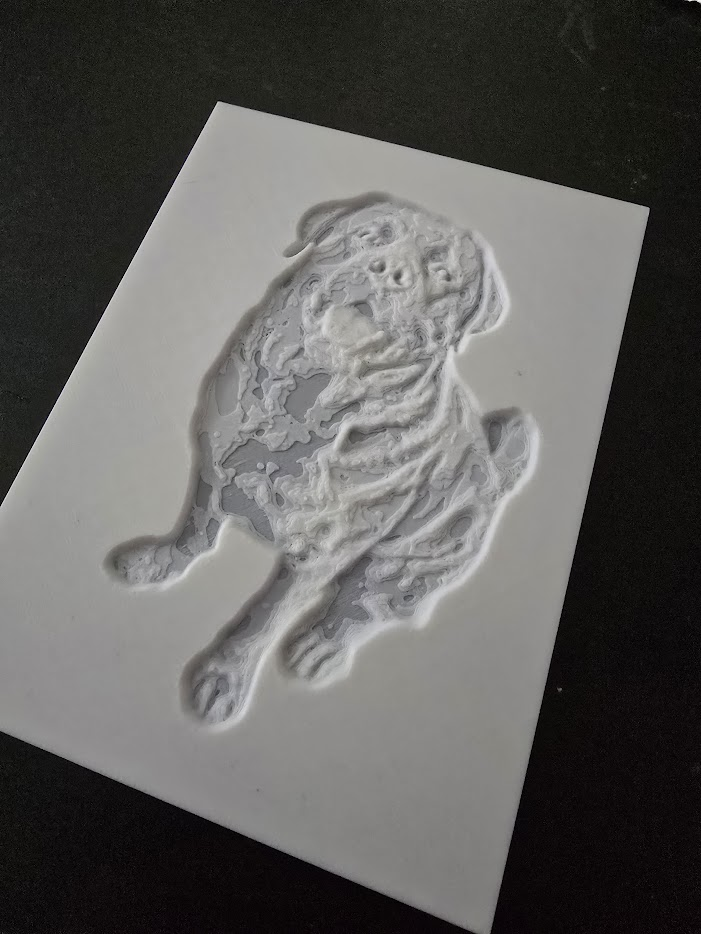

# 3D-Modellierung aus Bildern

Eine Sammlung von Python-Werkzeugen zur Umwandlung von Bildern in 3D-Modelle für den 3D-Druck.

## Showcase




## Entwickelt von

Martin Pfeffer

## Lizenz

MIT License

## Installationsanleitung

Alle benötigten Abhängigkeiten können über pip installiert werden:

```bash
pip install -r requirements.txt
```

## Enthaltene Werkzeuge

Das Paket enthält fünf Hauptskripte für unterschiedliche 3D-Modellierungsansätze:

### 1. image-to-stl.py

Konvertiert ein Bild in eine STL-Datei, wobei Helligkeitswerte als Höheninformationen interpretiert werden.

**Beispiel:**

```bash
python image-to-stl.py bild.jpg --max-height 10 --threshold 128 --timestamp
```

**Hauptfunktionen:**

- Verschiedene Höhenoptionen (max-height, base-height)
- Thresholding für Hintergrunderkennung
- Invertierung von hellen/dunklen Bereichen
- Glättung der Oberfläche
- "Object-only"-Modus für Modelle ohne Grundplatte
- Zeitstempel-Option

### 2. contour-crafting.py

Erstellt ein 3D-Modell aus Höhenlinien eines Bildes.

**Beispiel:**

```bash
python contour-crafting.py bild.jpg -n 15 -e 2.0 -p --timestamp
```

**Hauptfunktionen:**

- Extraktion von Höhenlinien aus Bildern
- Spezieller Foto-Modus für realistischere Fotos
- Anpassbare Anzahl von Konturlinien
- Glättung und Invertierung
- Zeitstempel-Option

### 3. topographic-layering.py

Erstellt ein 3D-Modell aus einem Bild mit topografischem Ansatz, besonders geeignet für Landschaftsbilder.

**Beispiel:**

```bash
python topographic-layering.py landschaft.jpg -z 15 -s 1.5 -r 2 --timestamp
```

**Hauptfunktionen:**

- Z-Skalierung für die Höhe
- Glättung der Oberfläche
- Reduzierung der Auflösung für kleinere Dateien
- Zeitstempel-Option

### 4. stl-repair-tool.py

Repariert beschädigte 3D-Modelle (STL-Dateien) für den 3D-Druck.

**Beispiel:**

```bash
python stl-repair-tool.py modell.stl -v -i --timestamp
```

**Hauptfunktionen:**

- Reparatur von non-manifold Kanten
- Fixierung von Normalen
- Entfernung doppelter Flächen
- Füllen von Löchern
- Detaillierte Ausgabe-Option
- Zeitstempel-Option

### 5. text-to-stl.py (NEU)

Erstellt 3D-Modelle aus Text mit anpassbaren Schriftarten und Eigenschaften.

**Beispiel:**

```bash
python text-to-stl.py "Mein Text" --font-size 60 --thickness 10 --timestamp
```

**Hauptfunktionen:**

- Erstellung von 3D-Text mit benutzerdefinierten Schriftarten
- Anpassbare Textgröße und -dicke
- Option zum Hinzufügen einer Bodenplatte
- Spiegelung des Textes
- Weichzeichnungsoptionen für abgerundete Kanten
- Zeitstempel-Option
- Vorschaufunktion für das Endergebnis

## Gemeinsame Funktionen

Alle Skripte bieten:

- Zeitstempel-Option (`--timestamp` oder `-t`): Fügt einen Zeitstempel im Format yyyy-MM-dd-HH-mm-ss an den
  Ausgabedateinamen an
- Automatische Erstellung eines Ausgabeordners unter `output/[skript-name]/`
- Fehlerbehandlung und informative Ausgaben

## Anforderungen

- Python 3.6 oder höher
- Installierte Module (siehe requirements.txt):
    - numpy
    - pillow
    - numpy-stl
    - opencv-python
    - matplotlib
    - scipy
    - scikit-image (für erweiterte Modi)
    - tqdm
    - trimesh
    - pyglet

## GUI-Anwendung

Das Paket enthält eine grafische Benutzeroberfläche, die alle Werkzeuge integriert:

```bash
cd stl3d-gui
python main.py
```

Die GUI bietet:

- Benutzerfreundliche Oberfläche für alle Werkzeuge
- Echtzeit-Vorschau bei Text-zu-STL-Konvertierung
- Drag & Drop-Unterstützung für Bilder, STL-Dateien und Schriftarten
- Umfangreiche Einstellungsmöglichkeiten für alle Parameter
- Log-Ausgabe für detaillierte Informationen
- Material Design-Oberfläche

## Anwendungsbeispiele

### Erstellen eines Relief-Modells aus einem Bild

```bash
python image-to-stl.py portrait.jpg --max-height 5 --smooth 2 --output portrait_relief.stl
```

### Erstellen eines Modells mit Höhenlinien aus einem Foto

```bash
python contour-crafting.py foto.jpg -n 20 -e 1.5 -p -o foto_konturen.stl
```

### Erstellen eines topografischen Modells aus einer Landkarte

```bash
python topographic-layering.py landkarte.jpg -z 20 -s 2.0 -o landkarte_topo.stl
```

### Reparieren eines STL-Modells

```bash
python stl-repair-tool.py defektes_modell.stl -v -o repariertes_modell.stl
```

### Erstellen eines 3D-Textmodells

```bash
python text-to-stl.py "Mein 3D-Text" --font-size 80 --thickness 15 --add-base
```

## Hinweise

- Es wird empfohlen das jeweilige Objekt vor der Bearbeitung im Bild freizustellen - hierfür kann
  meine [ObjectCut](https://mrx3k1.de/objectcut-react/)-App genutzt werden
- Die Qualität der 3D-Modelle hängt stark von der Qualität und Art der Eingabebilder ab
- Größere oder hochauflösende Bilder können zu großen STL-Dateien führen
- Für Fotos wird der Foto-Modus in contour-crafting.py empfohlen
- Die Reparaturfunktionen können nicht alle Probleme beheben - für komplexe Reparaturen werden spezialisierte
  3D-Modellierungswerkzeuge empfohlen
- Bei Text-zu-STL werden je nach Betriebssystem Standardschriftarten genutzt, wenn keine explizite Schriftart angegeben wird